# Search-to-pursuit system flow

```mermaid
flowchart LR
    A[Legacy cooperative search<br/>multi-UAV area coverage] -->|target detected| B[Track handoff<br/>noisy position and covariance]
    B --> C[Target starts evasive motion]
    C --> D[Three pursuers dispatched<br/>3-v-1 episode starts]
    D --> E[Local FOV/LOS sensing<br/>KF track update]
    E --> F[Intermittent directed links<br/>freshness-aware CI]
    F --> G[HGAT-MAPPO<br/>relative waypoint]
    G --> H[Local MPC and safety filter]
    H -->|geometry held for H steps| I[Cooperative capture]
    F -. outage or occlusion .-> E
```

The search and pursuit environments are trained and evaluated independently;
their only interface is the noisy target track handed off at the start of the
3-v-1 episode.

