# Search-to-Pursuit System Flow

> This document describes the **current implementation** of the search-to-pursuit pipeline in the repository.  
> The cooperative-search module and the pursuit module are **trained and evaluated independently**. The search module is treated as a completed upstream task and is not modified by the pursuit-learning work.

## 1. Current system flow

```mermaid
flowchart LR
    A[Cooperative search module<br/>multi-UAV target discovery] -->|target detected| B[Initial pursuit handoff<br/>noisy target track initialization]
    B --> C[3-v-1 pursuit episode starts<br/>three pursuers + one evader]
    C --> D[Target remains observable during pursuit<br/>continuous noisy 3-D position measurements]
    D --> E[3-D target-state estimation<br/>position + velocity track]
    E --> F[HGAT-MAPPO<br/>decentralized policy with shared actor]
    F --> G[4-D continuous action<br/>vx, vy, vz, yaw-rate references]
    G --> H[Reduced-order quadrotor autopilot<br/>velocity/attitude response and dynamic limits]
    H --> I[Safety feasibility check<br/>boundary / building / obstacle rejection]
    I --> J{Any active UAV<br/>inside capture radius?}
    J -->|Yes| K[Capture success<br/>episode terminates]
    J -->|No| L[Evader advances<br/>next pursuit step]
    L --> D
```



## 2. Search-to-pursuit interface

The search module and pursuit module remain separate tasks.

The search stage is assumed to have already discovered the target before a pursuit episode begins. At pursuit reset, the environment initializes a noisy target track that represents the search-to-pursuit handoff. The handoff is used to initialize the pursuit tracker; the pursuit episode does **not** return to the search task after this point.

Current implementation:

```text
Search completed
    ↓
Noisy initial target-track handoff
    ↓
Independent pursuit episode
```

The current simulator does not require the search environment to remain active during pursuit, and the pursuit policy is trained independently from the search policy.

## 3. Target observability during pursuit

The current main pursuit configuration uses:

```python
pursuit_target_observable = True
```

Therefore, the evader remains observable to every active pursuer throughout the pursuit episode. The policy does **not** receive exact target truth directly; instead, each active UAV receives a noisy target-position measurement and the existing tracking pipeline estimates the target state.

Conceptually:

\[
z_i(t) = p_e(t) + \epsilon_i(t)
\]

where \(z_i(t)\) is UAV \(i\)'s noisy target measurement.

The target tracker then maintains an estimate such as:

\[
\hat{x}_{e,i}(t)
=
[\hat{x},\hat{y},\hat{z},\hat{v}_x,\hat{v}_y,\hat{v}_z]^\top.
\]

### Important clarification

The repository still contains FOV/LOS and MID-360/LiDAR-related code paths for optional experiments or ablations. They are **not the default target-observation mechanism** of the current main pursuit configuration.

Therefore, the main flow should not be described as:

```text
Local FOV/LOS sensing → target loss → reacquisition
```

for the current primary pursuit experiment.

## 4. Communication assumption in the current pursuit task

The pursuit task currently uses reliable teammate-state sharing as the default configuration:

```python
comm_mode = "full"
outage_base_prob = 0.0
outage_jammed_prob = 0.0
```

Weak/intermittent communication mechanisms are retained in the inherited infrastructure and may be used for separate ablations, but communication disruption is **not part of the default pursuit difficulty**.

Target estimation, track fusion, and messaging mechanisms remain available in the implementation, but the main quadrotor pursuit configuration sets the corresponding information/communication reward terms to zero. They therefore serve primarily as state-estimation and diagnostic infrastructure rather than the main optimization objective.

## 5. HGAT-MAPPO decision layer

The pursuit controller uses a parameter-shared multi-agent actor with centralized training and decentralized execution.

For UAV \(i\):

\[
a_i \sim \pi_\theta(a_i\mid o_i),
\]

where the actor input contains the UAV's own state together with target, teammate, and obstacle/building information encoded by the pursuit observation/heterogeneous-graph pipeline.

The current pursuit task does **not** output a relative waypoint from MAPPO.

The policy uses a four-dimensional continuous action:

\[
a_i=[a_x,a_y,a_z,a_\psi]\in[-1,1]^4.
\]

The environment converts it to:

\[
[v_x^d,v_y^d,v_z^d,\dot{\psi}^d].
\]

Thus, the current high-level decision contract is:

```text
HGAT-MAPPO
    ↓
world-frame desired velocity (vx, vy, vz)
    +
desired yaw rate
```

## 6. Current flight-control layer

The current MAPPO output is **not** passed to a local MPC controller.

Instead, the four-dimensional velocity/yaw-rate reference is executed by a reduced-order quadrotor autopilot surrogate. The model includes, among other constraints:

- finite velocity response time;
- horizontal and vertical acceleration limits;
- tilt limits;
- attitude response;
- yaw-rate response;
- body-rate limits.

The current execution chain is therefore:

```text
HGAT-MAPPO
    ↓
[vx, vy, vz, yaw_rate] reference
    ↓
Reduced-order quadrotor autopilot
    ↓
Candidate next state
```

This flight-control model is a training surrogate and should not be described as PX4 or as a full torque-level rigid-body controller.

## 7. Safety handling

After the flight-control model generates a candidate state, the environment checks feasibility against:

- arena boundaries;
- building prisms;
- obstacle clearance.

If the candidate transition is unsafe, the transition is rejected and the vehicle state is kept near its previous state with velocity/body-rate damping. A controller-rejection/safety penalty is then recorded.

Therefore, the current low-level execution path is:

```text
Velocity/yaw-rate reference
    ↓
Reduced-order autopilot
    ↓
Safety feasibility check
    ↓
Accepted motion OR rejected unsafe transition
```

## 8. Current capture condition

The current quadrotor pursuit task uses:

```python
capture_mode = "single_distance"
capture_required_uavs = 1
capture_hold_steps = 1
```

The capture radius is defined from the configured target diameter as:

\[
r_c = 2d_{target}.
\]

With the current default target diameter:

\[
d_{target}=0.5\ \text{m},
\]

so:

\[
r_c=1.0\ \text{m}.
\]

Capture succeeds immediately when any active pursuer satisfies:

\[
\exists i:\quad
\|p_i-p_e\|_2\le r_c.
\]

Thus, the current terminal condition is **single-distance capture**, not a geometric enclosure held for multiple steps.

## 9. Role of encirclement in the current task

Although geometric enclosure is not the terminal condition, the pursuit reward contains an encirclement-progress shaping term. It encourages the three UAVs to improve their angular distribution around the evader while also accounting for distance and altitude consistency.

Therefore, the current task should be described as:

```text
3-UAV cooperative pursuit
    +
encirclement-oriented reward shaping
    +
distance-based terminal capture
```

rather than:

```text
geometric enclosure itself = capture
```

The desired learned behavior is still cooperative interception/containment, but success is finally declared by the distance criterion.

## 10. Current implementation summary

The current primary pursuit pipeline is:

```text
Completed cooperative-search task
        ↓
Noisy initial target-track handoff
        ↓
3-v-1 pursuit episode
        ↓
Target continuously observable with noisy measurements
        ↓
3-D target-state estimation
        ↓
HGAT-MAPPO
        ↓
4-D continuous action
[vx, vy, vz, yaw_rate]
        ↓
Reduced-order quadrotor autopilot
        ↓
Safety feasibility/rejection layer
        ↓
3-D pursuer/evader dynamics
        ↓
Encirclement/approach reward shaping
        ↓
Any one UAV enters the capture radius
        ↓
Capture success
```

## 11. Features retained for optional or future studies

The codebase still contains several mechanisms that are not part of the current default pursuit protocol, including:

- FOV/LOS-limited target visibility;
- MID-360/LiDAR target detection;
- intermittent/weak communication;
- track-fusion communication penalties/rewards;
- legacy discrete 2-D/3-D pursuit actions;
- legacy geometric multi-UAV capture conditions;
- cooperative guidance MPC used as a teacher/baseline.

These mechanisms should not be shown as active components of the current main HGAT-MAPPO pursuit pipeline unless a corresponding ablation or future experiment explicitly enables them.

## 12. Future control-layer extension

A constrained **local tracking MPC** may be introduced in a later development stage, but it is not part of the current implementation.

If introduced, the MPC should only execute MAPPO-provided references under dynamic and safety constraints:

```text
HGAT-MAPPO decision layer
        ↓
velocity/yaw-rate reference
        ↓
Local tracking MPC
        ↓
quadrotor dynamics
```

It should not replace MAPPO's cooperative role allocation or independently determine interceptor/flanker assignments. The existing `CooperativeGuidanceMPC3D` is therefore treated as a teacher/baseline high-level guidance policy rather than the current low-level controller.

---

## Code references

Current behavior is primarily defined by:

```text
quadrotor_pursuit_env.py
pursuit_evasion_env.py
pursuit_evasion_3d_env.py
pursuit_flight_controller.py
pursuit_rewards.py
pursuit_scenarios.py
marl_trainers.py
train_pursuit_with_demos.py
```

When this document conflicts with legacy comments or older diagrams, the active `QuadrotorPursuitEnv` configuration and execution path should be treated as the source of truth for the current pursuit experiment.
